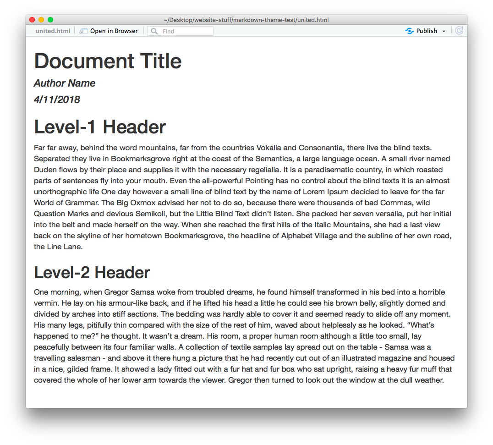
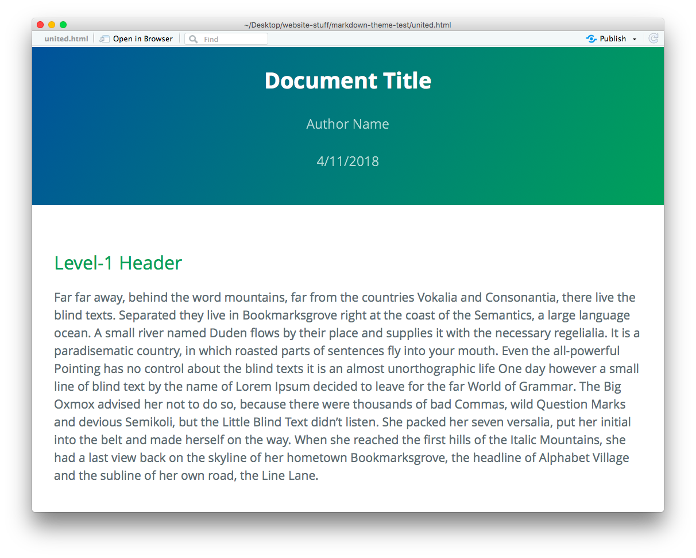
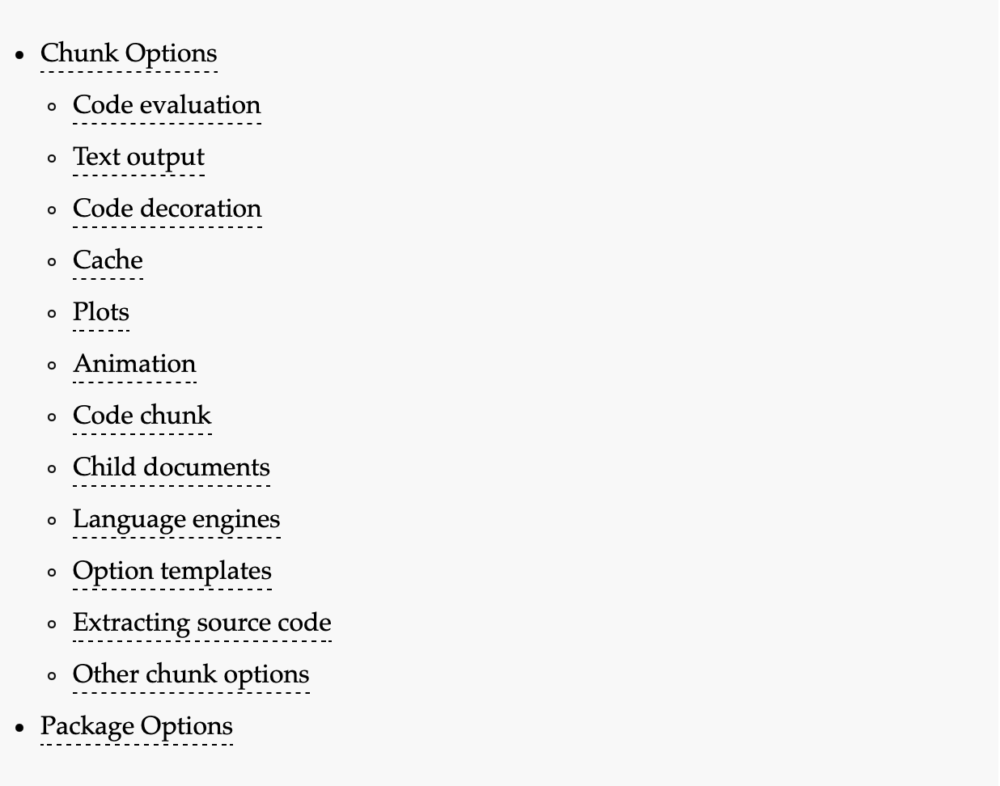
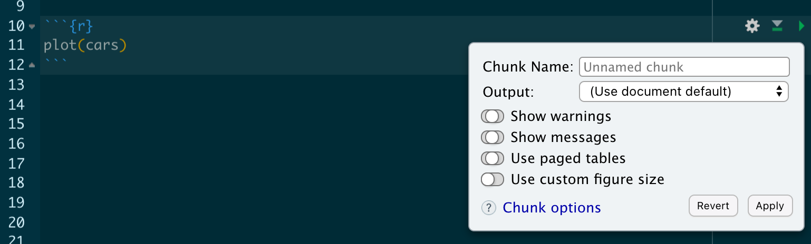
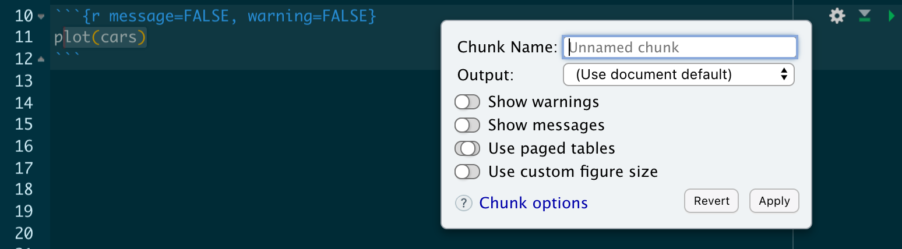
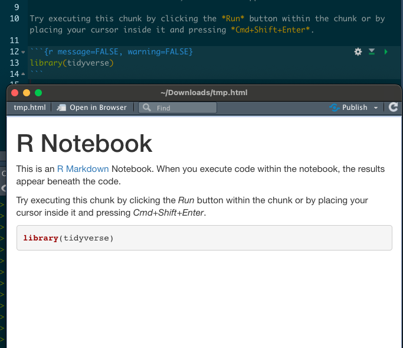
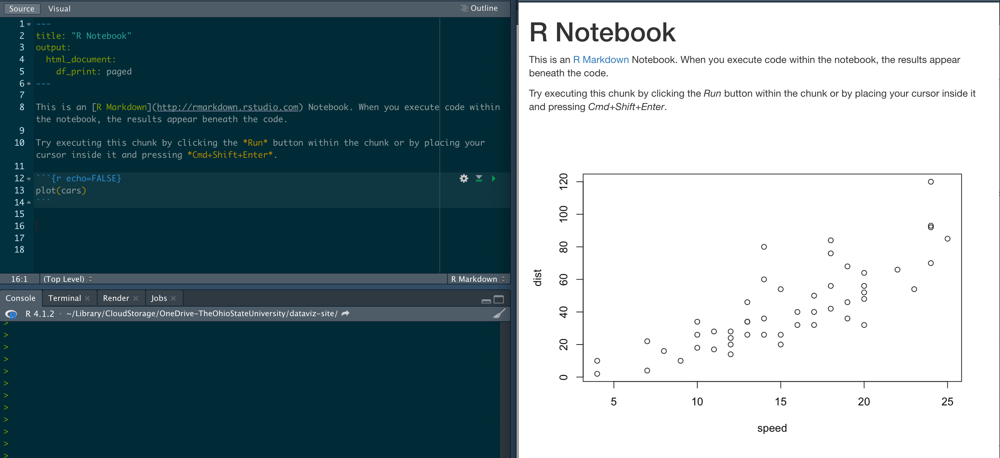
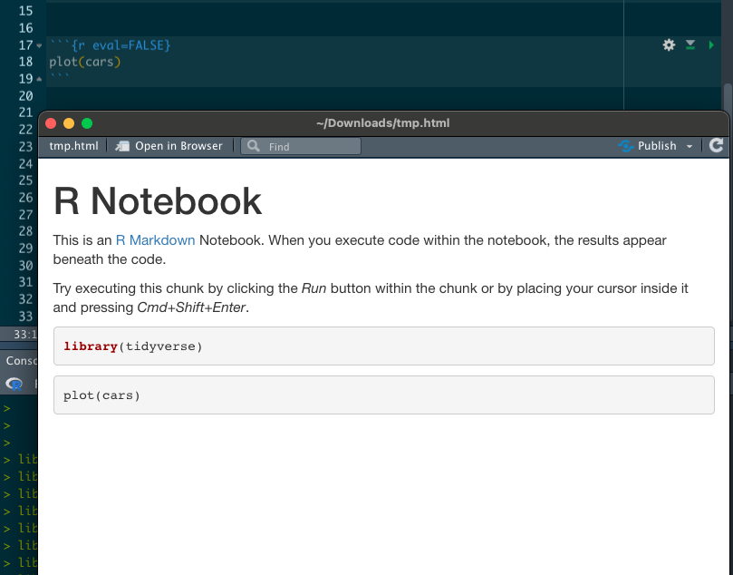
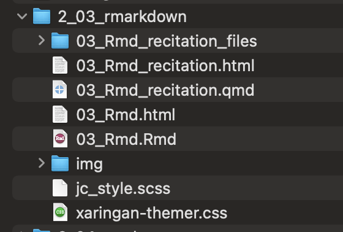

# Goal of recitations

- Get better at looking for information
- Get better at google *"How to ... in ggplot"*
- Each recitation will try to make you more independent in class exercise


# Goal of this recitation

- Modify the notebook appereance
- Modify the output/behavior of code chunks
- Insert images/videos

# Modifying notebook appereance

## Why to modify the notebook appeareance

- Helps to get users attention
- Creates a better looking documents
- Use your favorite colors (Kind of)


## Modifying notebook appereance

Default rmarkdown theme

{fig-align="center"}


## Modifying notebook appereance

Using themes to customize notebook appearance


::: {#fig-themes layout-ncol=2}




Rmakrdown themes from [prettydoc package](https://prettydoc.statr.me/themes.html)

:::


## Themes- How themes work?

Add a layer of makeup on our notebooks


::: {#fig-themes layout-ncol=2}


Default vs Leonids theme

:::


## Themes- What are they?

Ire a predefined set of style layers of *CSS code* that controls and modifies
how HTML elements are presented. 

# Hands on: Themes


## YAML example

Rmkarkdown documentation [here](https://bookdown.org/yihui/rmarkdown/html-document.html#appearance_and_style)

Notebok theme gallery [here](https://www.datadreaming.org/post/r-markdown-theme-gallery/)

::: {.fragment}
```yaml
---
title: Your awesome title
author: Your name
date: Some day
output:
  rmarkdown::html_document:
     theme: lumen
---
```
:::

## Using prettydoc package

You can find help about the cayman theme 
[here](https://cran.r-project.org/web/packages/prettydoc/vignettes/cayman.html)


```yaml
---
title: Your awesome title
author: Your name
date: Some day
output:
  ?---
     ?---
---
```

# Modifying chunks behaviour

## I want to ...

- Include  the output but not the code
- Include the code but not the output
- Run code but include nothing

## Code chunk options

Documentation information [here](https://yihui.org/knitr/options/#code-evaluation)

- There is a lot to modify in chunks

{fig-aling="center"}

## Chunk options toolbar

We can use the toolbar at the right side of the chunk.




## Turning warning and messages off




- Let's try with *libray(tidyverse)*

## Warning and message turn off

{fig-aling="center"}


## Text output *echo*

Boolean (TRUE or FALSE) whether to include the source code in the document

{fig-aling="center"}

## Code evaluation *eval* {.small}

- Boolean (TRUE or FALSE) whether to evaluate (run) the code.
- Default eval=TRUE
- Source code is included in the output document despite eval value

## Code evaluation *eval* {.small}

{fig-aling="center"}

# Adding images


## Structure of the directory

It is suggested to have a *img* directory to save all images to
be used in your notebook.


{fig-aling="center"}


## Rmarkdown code

```markdown
{image styel modification}
```

:::{.fragment}
```markdown
{fig-aling="center"}
```
:::{.fragment}
{fig-aling="center"}
:::
:::

## Hands on: Adding images 

- Create a *img* directory inside your working directory
- Select and save an image inside the *img* directory
- Add the image to your notebook

