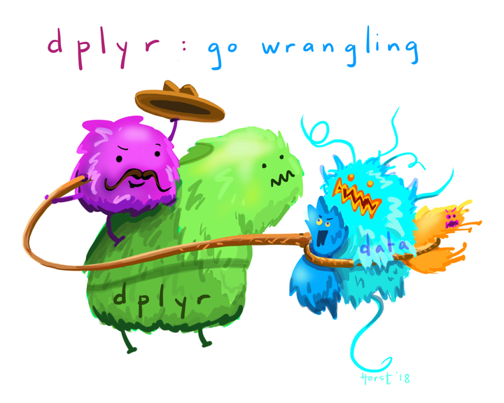

```{r setup, include=FALSE}
knitr::opts_chunk$set(echo = TRUE)
```

```{r data masterpiece, fig.alt = "A fuzzy monster with a lasso and a cowboy hat using it to wrangle other fuzzy monsters, with the styled text "dplyr: go wrangling"", fig.cap= "Figure from [Allison Horst](https://github.com/allisonhorst/stats-illustrations)", out.width = "70%", fig.align = "center", echo = FALSE}

```

# Introduction

This is a new lecture from the previous delivery of this course. In my last teaching, I found that the process of wrangling data was **by far** the thing that people had the most trouble with. In recitations, and for module assignments, I would provide data in a way that would need some adjustment before visualization can be made - and if I'm being honest, I heard a lot of rumblings about this.

Still, I am going to leave in the course activities that request data to the wrangled before visualiation. I am doing this because real data is often not structured precisely how it needs to be to make the visualizations you want. I want to provide you all some practice to get comfortable with using your data lassos. This is something you **need** to get comfortable with on your coding journey.

But, I have added in this extra lecture to explicitly go over what I think are the most useful wrangling functions and tools you can use in R. I hope this introduces you to some of what is possible with R, so it will trigger your memory later when you need to use it.

## What is the tidyverse?

["The tidyverse"](https://www.tidyverse.org/) is a collection of packages called  that are designed for data science. You can certainly use R without using the tidyverse, but it has many packages that I think will make your life a lot easier. We will be using mostly tidyverse functions in this class, with some base R syntax scattered throughout.

The "core tidyverse" contains the 8 packages below:

- [`dplyr`](https://dplyr.tidyverse.org/): for data manipulation
- [`ggplot2`](https://ggplot2.tidyverse.org/): a "grammar of graphics" for creating beautiful plots
- [`readr`](https://readr.tidyverse.org/): for reading in rectangular data (i.e., Excel-style formatting)
- [`tibble`](https://tibble.tidyverse.org/): using tibbles as modern/better dataframes
- [`stringr`](https://stringr.tidyverse.org/): handling strings (i.e., text or stuff in quotes)
- [`forcats`](https://forcats.tidyverse.org/): for handling categorical variables (i.e., factors) (meow!)
- [`tidyr`](https://tidyr.tidyverse.org/): to make "tidy data"
- [`purrr`](https://purrr.tidyverse.org/): for enhancing functional programming (also meow!)

We will be using many of these other packages in this course, but will talk about them as we go. There are more tidyverse packages outside of these core eight, and we will talk about some of them another time.

> **tl;dr** Tidyverse has a lot of packages that make data analysis easier.  None of them are required, but I think you'll find many tidyverse approaches  easier and more intuitive than using base R.  

You can find [here](https://tavareshugo.github.io/data_carpentry_extras/base-r_tidyverse_equivalents/base-r_tidyverse_equivalents.html) some examples of comparing tidyverse and base R syntax.

## Installing ggplot & tidyverse 

To install packages in R that are on the [Comprehensive R Archive Network (CRAN)](https://cran.r-project.org/), you can use the function `install.packages()`.

```{r install, eval = FALSE}
install.packages("tidyverse")
install.packages("ggplot2")
```

We only need to install packages once. But, every time we want to use them, we need to "load" them, and can do this using the function `library()`.

> **tl:dr** `install.packages()` once, `library()` every time.

## The pipe `|>` 

## Selecting columns with `select()`

## Choosing observations with `filter()`

## Make new columns with `mutate()`

## Doing things group-wise

### `group_by()`

### `summarize()`

## Vectorized functions

## Pivoting with `pivot_longer()` and `pivot_wider()`

## Joining data together

### `*_join()`

### `bind_rows()` and `bind_cols()`

## Separating values apart


# In class

In class, we will practice wrangling our data, getting comfortable with rearranging it such that we can do this later before plotting.

# Useful resources:


- Past wrangling Code Clubs:

  

