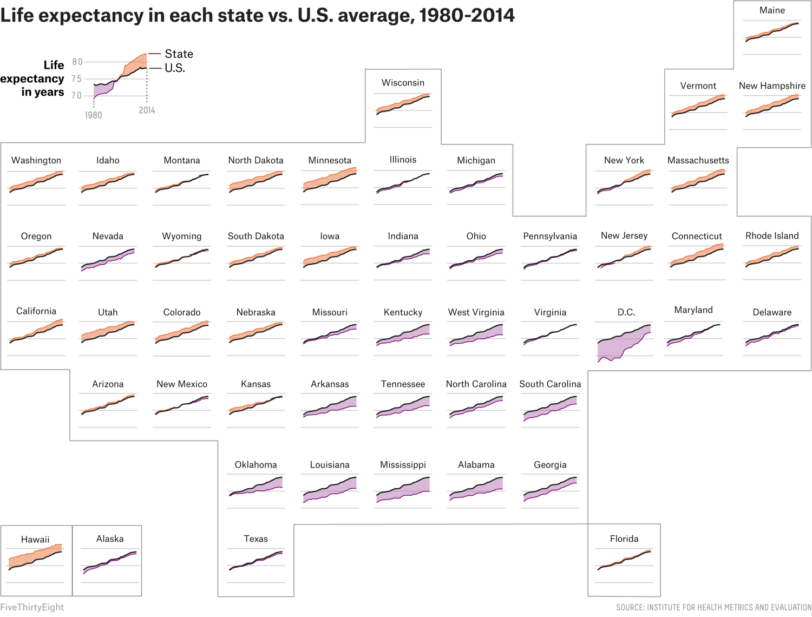

```{r setup, include=FALSE}
knitr::opts_chunk$set(echo = TRUE)
```

```{r data masterpiece, fig.alt = "A fuzzy monster in a beret and scarf, critiquing their own column graph on a canvas in front of them while other assistant monsters (also in berets) carry over boxes full of elements that can be used to customize a graph (like themes and geometric shapes). In the background is a wall with framed data visualizations. Stylized text reads “ggplot2: build a data masterpiece.", fig.cap= "Figure from [Allison Horst](https://github.com/allisonhorst/stats-illustrations)", out.width = "70%", fig.align = "center", echo = FALSE}
knitr::include_graphics("img/ggplot2_masterpiece.png")
```

## Introduction

We will will build upon our last lesson on [ggplot101](2_04_ggplot/04_ggplot.html) which focused on an overall understanding of the grammar of graphics, basic syntax, adding data, aesthetic mappings, and geoms. Today we will focus on some of the other more commonly adjusted layers:

* facets
* labels
* themes

### Load libraries and data
Before we get started, let's load our libraries and data.

```{r libraries, warning = FALSE, message = FALSE}
library(tidyverse)
library(gardenR)
```

And let's remember whats in `garden_harvest`.
```{r}
glimpse(garden_harvest)
```

## Facets

Faceting allows to create small multiples of plots, enabling the easy comparison across the entirety of your data. A benefit of plots like this is they are all structured the same way, so once you understand one, you can begin to look at trends across groups/treatments/conditions simply and easily.

Here is a more infographic example of using small multiples.

```{r small multiple, fig.alt = "A plot of small multiples, laid out in the shape of the United States, to show how life expectancy differs from the average in the US across the states. There is a relatively low life expectancy in Washington DC, and the south, and relatively high in Hawaii, the northeast, upper midwest, and west.", fig.cap= "Figure from [Five Thirty Eight](https://fivethirtyeight.com/features/as-u-s-life-expectancies-climb-people-in-a-few-places-are-dying-younger/)", out.width = "70%", fig.align = "center", echo = FALSE}

```

So we can easily see that states with more of a maroon color have a lower than average life expectancy, while those that are higher than average are orange. We also can see easily where each state is on the map, so we can begin to understand how geography is related to life expectancy. We can also see which states have gotten better (i.e. their people live longer) with time, and those that haven't. And this is all with a quick glance! 

If we look back to the plot we were using as our example last week, can see how we have a plot faceted by tomato `variety`. 

First lets select only the data for tomatoes.

```{r tomatoes-only}
# filter data to include only tomatoes 
# filter() is a useful function from dplyr (part of tidyverse)
# it allows us to select observations based on their values
garden_harvest_tomato <- garden_harvest %>%
  filter(vegetable == "tomatoes")
```

Let's remember what our base plot is currently looking like.
```{r first plot} 
garden_harvest_tomato %>%
  ggplot(aes(x = date, y = weight, color = variety)) +
  geom_line() +
  geom_point(size = 1) 
```

See how crowded this is? I think faceting might help us better see our data by variety.

There are two functions that allow you to facet:

* [`facet_wrap`](https://ggplot2.tidyverse.org/reference/facet_wrap.html): allows to  lay out your facets in a wrapped type. You can use `facet_wrap` if you have 1 variable you'd like to facet on.
* [`facet_grid`](https://ggplot2.tidyverse.org/reference/facet_grid.html): allows you to lay out your facets in a grid. You can use `facet_grid` if you have 1 or 2 variables you'd like to facet on.

There are a few different sets of syntax that work for faceting, but I think this is the most intuitive.

```{r facet wrap} 
garden_harvest_tomato %>%
  ggplot(aes(x = date, y = weight)) +
  geom_line() +
  geom_point(size = 1) +
  facet_wrap(vars(variety))
```

We will get a very reasonably different looking plot with `facet_grid` with the default settings.
```{r facet grid} 
garden_harvest_tomato %>%
  ggplot(aes(x = date, y = weight)) +
  geom_line() +
  geom_point(size = 1) +
  facet_grid(vars(variety))
```

Note because you have provided only one variable, ggplot has put that facet in one row.
```{r facet grid cols}
garden_harvest_tomato %>%
  ggplot(aes(x = date, y = weight)) +
  geom_line() +
  geom_point(size = 1) +
  facet_grid(cols = vars(variety))
```

We can make the faceting go by column, but this is also bad.

However, you might be thinking now that if you have two variables, and you want to facet by the combination of them, you could do that with `facet_grid`. Here is an example with the `mpg` dataset from the tidyverse (since there isn't really good data to demonstrate this from `garden_harevst`). 

```{r facet grid 2}
mpg %>%
  ggplot(aes(x = cty, y = hwy)) + # city and highway gas mileage
  geom_point() +
  facet_grid(cols = vars(class), # category of car
             rows = vars(drv)) # type of drive train, 4 wheel, front, rear
```

The default in both `facet_wrap` and `facet_grid` are for the x and y-axis to be fixed and constant among all the plots. This is often what you want to take advance of the comparisons between small multiples, but this is something you can change if you want.

```{r facet wrap free} 
garden_harvest_tomato %>%
  ggplot(aes(x = date, y = weight)) +
  geom_line() +
  geom_point(size = 1) +
  facet_wrap(vars(variety), scales = "free")
```

Do note how this affects how easy it is to compare among the facets now.

## Scales
Using [scales](https://ggplot2.tidyverse.org/reference/index.html#scales) allows you to control how the data are linked to the visual properties of your plot. Some books will include labels as a part of scales but I'm going to cover them separately.

Scales allow you to pick colors, shapes, alphas, lines, transformations (e.g. scaling your axes to a log scale), and others. You can also use scales to set the limits of your plots.

Scales functions start with `scale_`.

Here are some common things you might do with the `scale_` functions.

* [Set position scales for x and y data](https://ggplot2.tidyverse.org/reference/scale_continuous.html)
* [Positional scales for binning continuous data (x & y)](https://ggplot2.tidyverse.org/reference/scale_binned.html)
* [Continuous and binned colour scales](https://ggplot2.tidyverse.org/reference/scale_colour_continuous.html)
* [Sequential, diverging and qualitative colour scales from ColorBrewer](https://ggplot2.tidyverse.org/reference/scale_brewer.html)


## Labels
Having good labels helps your reader (and you, when you come back to the plot in the future) understand what its all about. 

In the `labs()` function, you can indicate:

* `x` for the x-axis label
* `y` for the y-axis label
* `title` for a title
* `subtitle` for a subtitle underneath your title
* `caption` for a caption

In `theme()` you can change characteristics of these labels like their size, fonts, justfication, etc.

## Themes
Themes will control all the non-data parts of your plot. There are some pre-set "complete" themes that you can recognize as they'll be called `theme_XXX()`, and you can adjust any theme parameters by setting parameters within `theme()`. There are probably 50 parameters you can set within `theme()` and they include text size, axis label orientation, the presence of a legend, and many others. 

## In class

In class, we will practice using ggplot and adjusting facets, scales, labels, and themes.

You can find the in class content [here](2_05_themes_labels_facets/05_ggplot_recitation.html).

### Useful resources:

-   [`ggplot2` cheatsheet](https://raw.githubusercontent.com/rstudio/cheatsheets/main/data-visualization.pdf)
-   [`ggplot2` documentation](https://ggplot2.tidyverse.org/)
-   [ggplot2: elegant graphics for data analysis by Hadley Wickham](https://ggplot2-book.org/index.html)
-   [A really compehensive list of resources compiled by Erik Gahner Larsen](https://github.com/erikgahner/awesome-ggplot2)
- Past ggplot Code Clubs:

  * [Visualizing Data by Michael Broe](https://biodash.github.io/codeclub/04_ggplot2/)
  * [ggplot round 2 by me](https://biodash.github.io/codeclub/05_ggplot-round-2/)
  * [Faceting, multi-plots, and animating](https://biodash.github.io/codeclub/10_faceting-animating/)
  * [Visualizing Data by Michael Broe a second one](https://biodash.github.io/codeclub/s02e06_ggplot2/)
  * [ggplot round 2 a second one by me](https://biodash.github.io/codeclub/s02e07_ggplot2_part2/)
  

