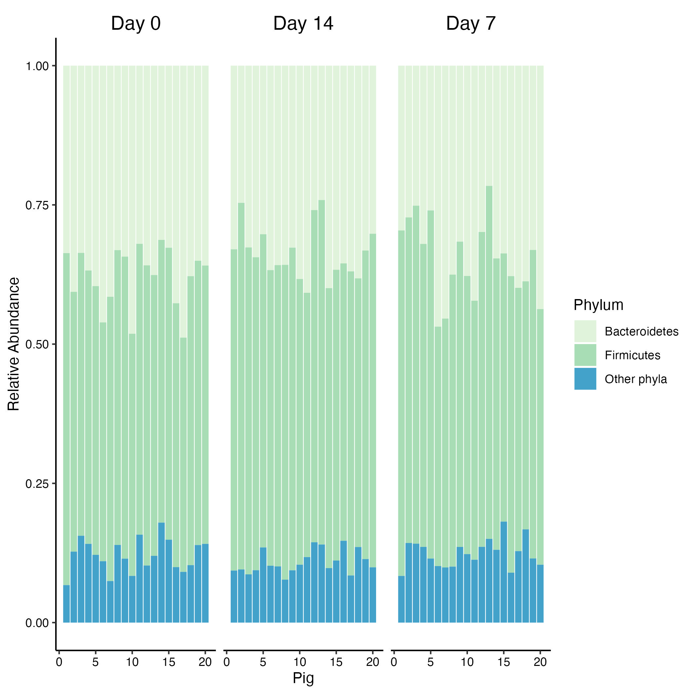

# Intoduction

Today we are going to work with microbiome data. In this recitation we
are going to provide two microbiome data from pig gut microbiome and
environmental microbiome. The pig microbiome data is the result of
shotgun metagenomic sequencing.

-   Pig microbiome study: [paper](https://journals.asm.org/doi/10.1128/spectrum.02506-22),
    [data](https://buckeyemailosu-my.sharepoint.com/:x:/g/personal/cooperstone_1_osu_edu/EY4vRHdMuKpOiuy-itag7ocB63AB3ukhjc0Y5jGRovfkvg?e=RnMz8e).
    
# Pig gut microbiome data

The goal of this recitation is to replicate the following plot, which
expresses the relationship between the Bacteroidetes and Firmicutes
while the rest of the Phyla levels were assigned to *others*.

```{r echo=FALSE, fig.align='center', fig.height=4, fig.width=4}

```

## How many rows and columns does the data have?

```{r message=FALSE, warning=FALSE, paged.print=FALSE}
library(tidyverse)
library(plotly)

pig_micro <- read_csv("data/Phyla_RelAbund_Final_Filtered_WithMetadata.csv")
dim(pig_micro)
```

The data contains 60 rows and columns

## How many phyla does the data contains and how many columns represents metadata of the experiment?

```{r}
glimpse(pig_micro[seq(3), seq(8)])
```

The first 5 rows represents metadata from *Sample_Name* to
*Diet_By_Time_Point* while the columns from *Acidbacteria* to the last
columns *Unclassified derived from sequence*.

## Computing the cumulative abundance for other phylum

### Create a new column with a new phyla assignation

Keep the phyla level when they are Firmicutes or Bacteroidetes,
otherwise assign Phyla to "Other level".

> Hint: You may need to pivot the data to evaluate the column names as
> observations

```{r}
pig_micro %>% 
  pivot_longer(cols = Acidobacteria:`unclassified (derived from other sequences)`,
              values_to = "Abundance", names_to = "Phyla") %>% 
  mutate(Phyla = case_when(Phyla == "Bacteroidetes" ~ Phyla,
                           Phyla == "Firmicutes" ~ Phyla,
                           TRUE ~ "Other phyla") ) %>% 
  head()
```

### Compute the cumulative abundance by the new Phyla levels that you created

```{r message=FALSE, warning=FALSE}

pig_clean <- pig_micro %>% 
  pivot_longer(cols = Acidobacteria:`unclassified (derived from other sequences)`,
              values_to = "Abundance", names_to = "Phyla") %>% 
  mutate(Phyla = case_when(Phyla == "Bacteroidetes" ~ Phyla,
                           Phyla == "Firmicutes" ~ Phyla,
                           TRUE ~ "Other phyla") ) %>% 
  group_by(Sample_Name, Phyla, Time_Point, Pig) %>% 
  summarise(Abundance = sum(Abundance)) 

head(pig_clean)
```

### Create the barplot in ggplot

```{r}
stack_barplot <- pig_clean %>% 
  ggplot(aes(as.numeric(Pig), Abundance, fill = Phyla, 
             text = glue::glue("{Phyla}: {round(Abundance, 3)*100}%"))) + 
  geom_col() +
  scale_fill_brewer(palette = "GnBu") +
  facet_grid(~Time_Point)+
  theme_classic()+
  labs(y="Relative Abundance", 
       fill="Phylum",
       x = "Pig") +
  theme(panel.grid = element_blank(), axis.text = element_text(color="black"),
        strip.text = element_text(color = "black", size = 14), 
        strip.background = element_blank())

stack_barplot
```

# Make the plot interactive

```{r}
ggplotly(stack_barplot,
         tooltip = "text")
```
